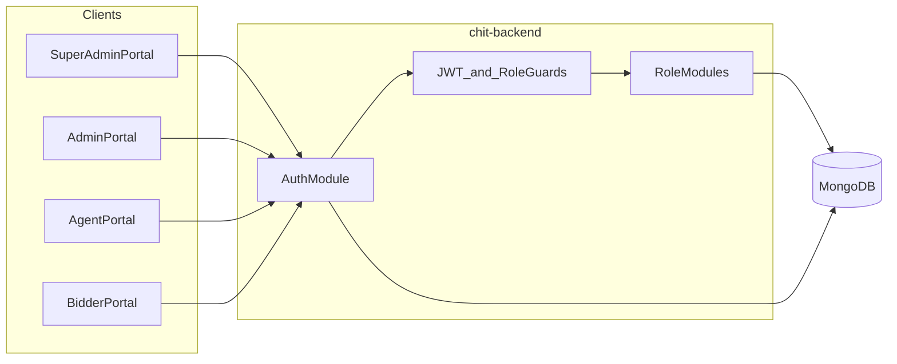

# Saina Chit Funds — Backend Architecture

**Document purpose:** Client review overview of the Node.js API architecture, role-based authentication, and how the system will scale as features are added.

**Stack:** Express.js · TypeScript · MongoDB (Mongoose)  
**Frontend:** Next.js (`Chit_React_Next`)  
**API base:** `/api/{API_VERSION}` (default `/api/v1`, configured via `API_VERSION` env)

---

## 1. System overview



| Layer | Responsibility |
|--------|----------------|
| Next.js portals | Role-specific login URLs, dashboards, UX validation |
| Express API | Auth, authorization, business rules, data access |
| MongoDB | Users, OTP sessions, future domain collections |

---

## 2. User roles & access

| Role | Internal value | Login URL (FE) | Dashboard | Capabilities |
|------|----------------|----------------|-----------|--------------|
| **Super Admin** | `super_admin` | `/super-admin/login` | `/dashboard/*` | Tiered: `full` (`*`), `manager`, `editor` |
| **Branch Store** | `branch_store` | `/admin/login` or `/branch-store/login` | `/admin-dashboard/*` | Subset of permissions assigned by Super Admin |
| **Agent** | `agent` | `/agent/login` | `/agent-dashboard/*` | Fixed permission set (auto-assigned) |
| **Bidder** | `bidder` | `/bidder/login` | `/Bidder-dashboard/*` | Fixed permission set (auto-assigned) |

See **[PERMISSIONS.md](./PERMISSIONS.md)** for the full permission matrix and route registry.

### Hard rules

1. Each role has a **dedicated login entry point**.
2. Phone + Aadhaar must match a user with **that exact role**.
3. Logging in at another role’s URL with another role’s credentials is **denied** (`403 ACCESS_DENIED`).
4. JWT is required for protected APIs; **role middleware** blocks cross-module access and **permission middleware** enforces fine-grained actions within a module.
5. Direct URL / dashboard manipulation on the FE is blocked by middleware using the same role claim.

---

## 3. Authentication flow

**Credentials:** Phone Number + Aadhaar Number → OTP on registered phone → JWT.

```mermaid
sequenceDiagram
  participant U as User
  participant FE as RoleLoginPage
  participant API as AuthAPI
  participant OTP as MockOtpProvider
  participant DB as MongoDB

  U->>FE: Open /{role}/login
  U->>FE: Enter phone + Aadhaar
  FE->>API: POST /api/v1/auth/{role}/request-otp
  API->>DB: Find user by phone + Aadhaar fingerprint + role
  alt Missing or wrong role
    API-->>FE: 403 Access Denied
  else Valid active user
    API->>OTP: Generate mock OTP
    API->>DB: Store OtpSession TTL
    OTP-->>API: Logged to console (dev)
    API-->>FE: 200 OTP sent
  end
  U->>FE: Enter OTP
  FE->>API: POST /api/v1/auth/{role}/verify-otp
  API->>DB: Verify OTP + re-check role
  API->>DB: Create RefreshSession
  API-->>FE: accessToken + refreshToken + user + redirectTo
  FE->>FE: Store tokens; go to role dashboard only
```

### Phase-1 OTP (mock / development)

- Fixed OTP from env (`MOCK_OTP`, default `123456`).
- Printed to server console; also returned as `mockOtpHint` in development responses only.
- Provider interface is swappable later (MSG91 / Twilio) without changing Auth routes.

### Access + refresh tokens

- Access JWT default TTL: `JWT_ACCESS_EXPIRES_IN` (15m). Includes `jti` + `sid`.
- Refresh token: opaque, hashed in Mongo; rotated on `POST /auth/refresh`. Reuse revokes the session family.
- Logout revokes the current refresh session; `logout-all` revokes every session for the user.

---

## 4. Folder structure

```text
chit-backend/
├── docs/
│   └── ARCHITECTURE.md          ← this document
├── src/
│   ├── config/                  # env, DB, constants/, rbac/, roles barrel
│   │   ├── constants/           # roles, permissions, routes catalog
│   │   └── rbac/                # role-permission maps, tiers, route registry
│   ├── common/                  # errors, response helpers, crypto utils
│   ├── middlewares/             # auth JWT, authorize(role), authorizePermission
│   ├── modules/
│   │   ├── auth/                # Shared role-aware login / OTP / me
│   │   ├── bidder-signup/       # Bidder self-registration (Aadhaar + DigiLocker)
│   │   ├── users/               # User model (identity)
│   │   ├── otp/                 # OTP sessions + mock provider
│   │   ├── chits/               # Shared chit CRUD (agent / branch / super-admin)
│   │   ├── super-admin/         # Provisioning APIs + permission catalog
│   │   ├── branch-store/        # Branch store APIs (scaffold)
│   │   ├── admin/               # Deprecated alias module
│   │   ├── agent/               # Agent-scoped APIs (scaffold)
│   │   └── bidder/              # Bidder-scoped APIs (scaffold)
│   ├── routes/                  # Route registry + registerRoutes(app)
│   ├── server/                  # listenWithPortFallback
│   ├── scripts/seed.ts
│   ├── app.ts
│   └── server.ts
├── .env.example
├── package.json
└── README.md
```

### Design rationale

- **Shared core** (`auth`, `users`, `otp`, middlewares) stays thin and reusable.
- **Role modules** grow independently (chits, bids, branches, reports) without polluting other portals.
- New feature → add service/controller under the owning role module (or a shared domain module if multi-role).

---

## 5. Data model (phase 1)

### User

| Field | Notes |
|-------|--------|
| `name`, `countryCode`, `phone` | Identity; unique `(phone, role)` |
| `aadhaarFingerprint` | HMAC of Aadhaar (no plaintext at rest); unique `(fingerprint, role)` |
| `role` | `super_admin` \| `branch_store` \| `agent` \| `bidder` |
| `permissions[]` | Tier markers for super_admin; assignable subset for branch_store; fixed sets for agent/bidder |
| `status` | `active` \| `inactive` \| `blocked` |
| `createdBy` | Provenance for admins / future agents |
| `gender`, `dateOfBirth`, `aadhaarAddress` | Optional KYC fields (self-registered bidders) |
| `currentAddress`, `aadhaarLast4` | Manual current address + Aadhaar last-4 |
| `aadhaarVerifiedAt`, `verificationMethod` | `manual` \| `digilocker` \| `admin_provisioned` |

### OtpSession

Short-lived session with hashed OTP, attempt counter, TTL index (`expiresAt`).

### RefreshSession

Hashed refresh tokens bound to a user + session family. Supports rotation and reuse detection (theft → revoke family). TTL via `expiresAt`.

### Chit

Shared domain collection for chit groups. Key fields: `chitCode` (unique), `type`, `amountInLakhs`, installment/months config, `agentId`, `branchStoreId`, `members[]` (bidder refs), soft-delete via `status: deleted`. Scoped reads/writes by role.

### BidderSignupSession

Short-lived bidder self-registration session (manual Aadhaar OTP or DigiLocker). Stores HMAC Aadhaar fingerprint, OTP hash (manual path), DigiLocker OAuth state, and a **sealed** verified profile after KYC. TTL via `expiresAt`.

---

## 6. API conventions

### Base URL

`http://localhost:4000/api/v1` (or `/api/{API_VERSION}`)

### Auth endpoints

| Method | Path | Auth | Description |
|--------|------|------|-------------|
| POST | `/auth/:role/request-otp` | Public | Phone + Aadhaar; SMS OTP **or** `{ requires2fa: true }` if TOTP enabled |
| POST | `/auth/:role/verify-otp` | Public | Verify SMS OTP; return token pair (rejected if 2FA enabled) |
| POST | `/auth/:role/verify-2fa` | Public | Verify TOTP; return token pair (2FA-enabled accounts only) |
| POST | `/auth/refresh` | Public | Rotate refresh token; return new pair |
| GET | `/auth/me` | Bearer | Current user profile |
| POST | `/auth/logout` | Bearer | Revoke current refresh session (`sid`) |
| POST | `/auth/logout-all` | Bearer | Revoke all refresh sessions for the user |
| GET | `/auth/security` | Bearer | Security status + role `allowed` flags |
| POST | `/auth/security` | Bearer | Configure totp / screen_lock / biometric |
| POST | `/auth/security/unlock` | Bearer | Unlock after screen lock (pin / totp / biometric) |

See **[AUTH_REQUIREMENTS.md](./AUTH_REQUIREMENTS.md)** for role matrix.

### Chits (shared domain)

Base: `/api/v1/chits` — roles: `super_admin` | `branch_store` | `agent` (bidder excluded).  
Permissions: `chits:read` (list/get/summary), `chits:write` (create/update/delete).  
Scoped by `agentId` / `branchStoreId`; soft-delete via `status: deleted`.

| Method | Path | Description |
|--------|------|-------------|
| GET | `/chits` | List chits (scoped; filter by amount, status, agentId, q) |
| GET | `/chits/summary` | Aggregate counts by `amountInLakhs` (dashboard tiers) |
| GET | `/chits/:id` | Chit detail + members |
| POST | `/chits` | Create chit (auto `chitCode`; optional members) |
| PATCH | `/chits/:id` | Update chit config / members |
| DELETE | `/chits/:id` | Soft-delete chit |

### Tokens

- **Access JWT** — short-lived (default `JWT_ACCESS_EXPIRES_IN=15m`); claims include `jti` + `sid`.
- **Refresh token** — opaque, hashed in `RefreshSession`; default `JWT_REFRESH_EXPIRES_IN=7d`. Rotated on each refresh; reuse of an old refresh revokes the whole session family.
- `authenticate` middleware **verifies only** — it does not mint tokens on every request.

### Bidder / Agent signup endpoints (public, rate-limited)

Bases: `/auth/bidder/register` and `/auth/agent/register` (same shapes; agent creates `agent` role).

| Method | Path | Description |
|--------|------|-------------|
| POST | `/aadhaar/request-otp` | Start manual Aadhaar OTP (12 digits) |
| POST | `/aadhaar/resend-otp` | Resend OTP for signup session |
| POST | `/aadhaar/verify-otp` | Verify OTP; seal read-only KYC profile |
| POST | `/digilocker/start` | Start DigiLocker mock OAuth; return `authorizationUrl` |
| GET | `/digilocker/callback` | DigiLocker callback; redirect or JSON (`Accept: application/json`) |
| GET | `/session/:sessionId` | Session status + sealed profile |
| POST | `/complete` | Create user from sealed KYC + phone/currentAddress; return token pair |

KYC fields from Aadhaar are sealed server-side — `complete` only accepts `phone` and optional `currentAddress`. Mock OTP is `MOCK_OTP` (default `123456`). DigiLocker mock uses `code=mock-digilocker-code`.

`:role` ∈ `super-admin` \| `branch-store` \| `admin` (alias) \| `agent` \| `bidder`

### Super Admin (bootstrap)

| Method | Path | Auth | Description |
|--------|------|------|-------------|
| POST | `/super-admin/branch-stores` | Super Admin (manager+) | Create branch store user + `permissions[]` |
| GET | `/super-admin/branch-stores` | Super Admin (editor+) | List branch store users |
| POST | `/super-admin/agents` | Super Admin (manager+) | Create agent |
| POST | `/super-admin/bidders` | Super Admin (manager+) | Create bidder |
| POST | `/super-admin/staff` | Super Admin (`*` only) | Create super admin staff with tier |
| GET | `/super-admin/permissions` | Super Admin | Permission catalog for provisioning |

Deprecated aliases: `POST/GET /super-admin/admins`

### Standard response shape

```json
{
  "success": true,
  "message": "Login successful",
  "data": { }
}
```

Error:

```json
{
  "success": false,
  "message": "Access Denied",
  "code": "ACCESS_DENIED"
}
```

### JWT claims

`{ sub, role, permissions, phone, name }` — Authorization: `Bearer <token>`

---

## 7. Security controls

| Control | Implementation |
|---------|----------------|
| Role-bound login | Lookup requires phone + Aadhaar + **requested role** |
| Aadhaar at rest | HMAC fingerprint (secret from env); not stored in plaintext |
| OTP | Hashed; expiry; max attempts; rate limit on OTP routes |
| Transport hardening | Helmet, CORS allowlist, JSON body limit |
| Cross-role API | `authenticate` + `authorize(...roles)` on every role module |
| Permission-level API | `authorizePermission` / `authorizeIf` on sensitive endpoints |
| Enumeration | Same denial message for wrong role / missing user where practical |

---

## 8. Frontend alignment

| Concern | Approach |
|---------|----------|
| Separate login screens | Shared form; role from URL (`/super-admin/login`, etc.) |
| Session | Access token in cookie / storage; sent as Bearer |
| Route protection | Next.js middleware maps path prefix → required role |
| Access Denied | Dedicated page when role mismatch or unauthenticated |
| Redirect after login | Driven by API `redirectTo` per role |

---

## 9. Roadmap (post auth)

1. Real SMS OTP provider behind existing `OtpProvider` interface.
2. ~~Super Admin: branches, chits CRUD with permission checks per route.~~ **Chits CRUD shipped** (`/api/v1/chits`).
3. Domain modules: auctions/bids, subscriptions, invoices, reports; bidder-facing “my chits”.
4. Permission audit log on user permission changes.
5. Optional refresh tokens / Redis session store.

---

## 10. Local demo credentials (after seed)

| Field | Value |
|-------|--------|
| Portal | `/super-admin/login` |
| Phone | `+91 9999999999` (configurable via env) |
| Aadhaar | `123456789012` |
| OTP | `123456` (mock) |

---

*Document version: 1.0 · Saina Chit Funds · Architecture review*
